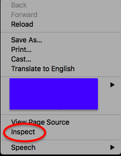
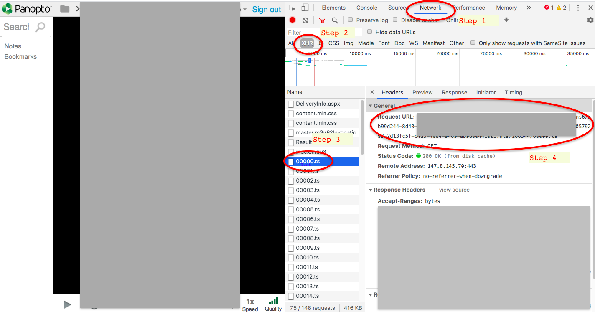

# Download tool for panopto video

Author: HF

This works for macOS 10.11.16. It should work for other macos machines as well. 

**Disclaimer**: this information is shared among a few students who are troubled by unstable panopto servers. No commercial use or use for purposes other than learning is allowed. 

## Requirements

1. `wget`

   Installation instruction for macOS: https://www.cyberciti.biz/faq/howto-install-wget-om-mac-os-x-mountain-lion-mavericks-snow-leopard/

   Instructions for installation on other os are readily available on the internet.

2. `ffmpeg`

   Download: http://ffmpeg.org/download.html

   Unzip. I personally put it under `~/Downloads`. If you choose to put it in other directories, you need to modify codes calling `ffmpeg` in `Concatenation.sh`.

## Start by finding the video url

1. Open the link to your panopto video in google chrome.

2. Right click anywhere on the panopto video page. Choose inspect.

   

3. On the right hand side of the window, there should be a new pop-up.

   - step 1: select "Network”

   - step 2: select "XHR”

   - step 3: there should be a list of files named "xxxxx.ts" below starting from "00000.ts", select any one of them. (If they do not appear, wait for a few minutes or refresh page)

   - step 4: On the right hand side of the file list, there should be some info about this specific request. Select and copy the "Request URL" under "General", we will use this later. The format should be something like 

     ```
     https://lecturecapture.abc.edf/blahblah/blahblah/xxxxx.ts
     ```

   


## Download!

In Shell ("Terminal" if you use macOS), run `sh <PATH>/publish/GetVideo.sh` (replace <PATH> by the location you choose to put the scripts.

You will see prompts for:

- Name of downloaded content: make up a name you like.

- URL prefix (the URL you copied in the previous section, right before the xxxxx.ts part)

  - Example: if the URL was `https://lecturecapture.abc.edf/blahblah/blahblah/xxxxx.ts` then please enter `https://lecturecapture.abc.edf/blahblah/blahblah/`

- Index of  the first file: enter 0 if you are downloading from the beginning of video.

- Index of the last file: pull the progress bar of webpage video towards the end, and check out the file list to find out!

  

- Hit ENTER

## When it is done

You should find the video in `~/Downloads/outputdir`

## Final words

Hope everyone stay safe and healthy. Please share this with anyone as long as this is not used for any purpose other than learning.
